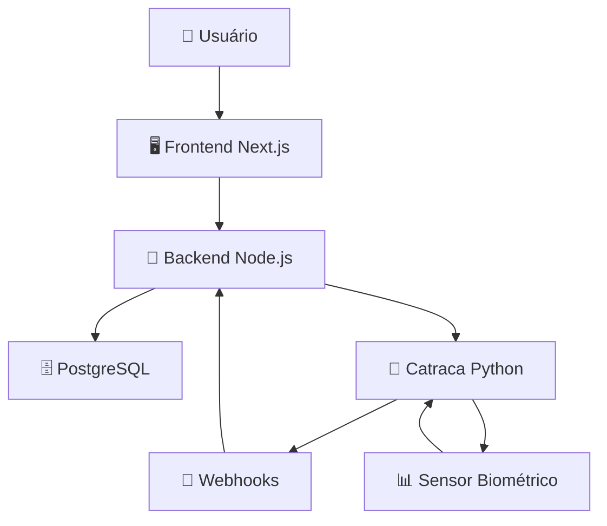

# 🎓 Sistema de Controle de Acesso Biométrico - Catraca Inteligente
### *Trabalho de Conclusão de Curso - Análise e Desenvolvimento de Sistemas*

**Status do Projeto:** ✅ **Em Produção** | **Versão:** 1.0 | **Última Atualização:** Novembro 2024


## 📌 Visão Geral

Sistema completo de controle de acesso biométrico desenvolvido para **garantir segurança em ambientes acadêmicos**. A solução integra hardware especializado com software web moderno para oferecer controle preciso de acessos físicos com rastreabilidade completa.

**🎯 Motivação:** Desenvolvido em resposta a incidentes de segurança na instituição, proporcionando **controle granular** e **auditoria completa** de todos os acessos aos laboratórios e espaços acadêmicos.

## 🏗️ Arquitetura do Sistema



### **Componentes Principais:**

| Componente | Tecnologia | Função |
|------------|------------|--------|
| **Frontend** | Next.js 14 + TypeScript + Tailwind | Interface administrativa responsiva |
| **Backend** | Node.js + Express + JWT | API REST + Webhook handling |
| **Catraca** | Python + Flask + PyFingerprint | Processamento biométrico em tempo real |
| **Banco** | PostgreSQL + Docker | Armazenamento de dados e logs |
| **Comunicação** | Webhooks + REST API | Sincronização em tempo real |

## 🎯 Funcionalidades Principais

### 👥 **Gestão de Usuários**
- ✅ Cadastro de estudantes, funcionários e visitantes
- ✅ Hierarquia de perfis (Admin, Portaria, RH, Estudante)
- ✅ Upload de fotos via câmera/galeria
- ✅ Validação de documentos (RA 13 dígitos, Matrícula 5 dígitos, RG)
- ✅ Edição e exclusão de usuários

### 🔐 **Sistema Biométrico Avançado**
- ✅ Cadastro em tempo real com feedback visual
- ✅ Stepper interativo com webhooks para todas as etapas
- ✅ Tratamento robusto de erros (timeout, duplicata, conexão)
- ✅ Componente `ErrorDisplay` com opções de recuperação
- ✅ Comunicação assíncrona via polling + webhooks

### 📋 **Gestão de Acessos Inteligente**
- ✅ Registro automático de entradas/saídas por biometria
- ✅ Controle por períodos (Manhã, Tarde, Noite)
- ✅ Logs detalhados de auditoria com filtros
- ✅ Dashboard com métricas em tempo real

### 🛡️ **Segurança e Auditoria**
- ✅ Autenticação JWT com refresh tokens
- ✅ Hash de senhas com bcrypt
- ✅ Hash de templates biométricos
- ✅ Logs completos de todas as operações
- ✅ Controle de permissões granular por perfil

## 🛠️ Stack Tecnológica

### **Backend (Node.js + Express)**
```javascript
// Tecnologias principais
- Node.js 18+ | Express.js | TypeScript
- PostgreSQL | Docker | JWT | bcrypt
- Webhooks | REST API | CORS
```

### **Frontend (Next.js 14)**
```typescript
// Stack moderna e escalável
- Next.js 14 | React 18 | TypeScript
- Tailwind CSS | Context API | Hooks
- WebSocket Simulation | Error Boundaries
```

### **Hardware (Python + Flask)**
```python
# Sistema embarcado
- Python 3.8+ | Flask | PyFingerprint
- Sensor biométrico BY50 | BTVE10 TV Box
- Relé 5V | GPIO | Comunicação serial
```

### **Infraestrutura**
```yaml
# Containerização e BD
- Docker | Docker Compose
- PostgreSQL 15 | PgAdmin
- Network: 192.168.11.0/24
```

## 🚀 Instalação e Configuração

### **Pré-requisitos**
- Node.js 18+ 
- Python 3.8+
- Docker e Docker Compose
- PostgreSQL 15 (via Docker)

### **1. Clone o Repositório**
```bash
git clone https://github.com/seu-usuario/sistema-catraca-biometrica.git
cd sistema-catraca-biometrica
```

### **2. Configuração do Banco de Dados**
```bash
# Subir container PostgreSQL
docker-compose up -d

# Verificar status
docker ps

# Acessar banco (opcional)
docker exec -it tcc-postgres psql -U postgres -d turnstile_system
```

### **3. Configuração do Backend**
```bash
cd backend

# Configurar variáveis de ambiente
cp .env.example .env
# Editar .env com suas configurações

npm install
npm run dev
```

### **4. Configuração do Frontend**
```bash
cd frontend

# Configurar variáveis
cp .env.local.example .env.local
# Editar .env.local:

npm install
npm run dev
```

### **5. Configuração da Catraca**
```bash
cd catraca

# Ambiente virtual (recomendado)
python3 -m venv venv
source venv/bin/activate  # Linux/Mac
# venv\Scripts\activate  # Windows

# Instalar dependências
pip install -r requirements.txt

# Executar sistema
python main.py
```

## 📊 Fluxo de Funcionamento

### **🔐 Acesso por Biometria:**
1. **Usuário** aproxima o dedo do sensor
2. **Catraca** captura digital e envia para backend
3. **Backend** valida no banco de dados
4. **Sistema** registra acesso e libera catraca
5. **Log** é salvo com todos os detalhes

### **👤 Cadastro de Biometria:**
1. **Administrador** cadastra usuário no sistema web
2. **Sistema** inicia cadastro biométrico via API
3. **Catraca** guia usuário pelas etapas via webhooks
4. **Frontend** mostra progresso em tempo real no stepper
5. **Digital** é salva no sensor e vinculada ao usuário

### **🚨 Tratamento de Erros:**
1. **Erro detectado** na catraca ou comunicação
2. **Webhook de erro** enviado para backend
3. **Frontend** mostra `ErrorDisplay` com opções
4. **Usuário** pode tentar novamente ou cancelar
5. **Log de erro** registrado para auditoria

## 🗄️ Estrutura do Banco de Dados

### **Tabelas Principais:**
```sql
-- Usuários do sistema
usuario

-- Digitais cadastradas
user_finger

-- Registros de acesso
log_entrada

-- Logs de auditoria
log
```

### **Tipos de Usuário:**
- `ESTUDANTE` - RA de 13 dígitos
- `FUNCIONARIO` - Matrícula de 5 dígitos  
- `VISITANTE` - RG de 8-9 dígitos
- `ADMIN` - Acesso completo ao sistema
- `PORTARIA` - Controle de entradas/saídas
- `RH` - Gestão de funcionários

## 🐛 Solução de Problemas Comuns

### **Catraca Offline**
```bash
# Verificar conexão com a catraca
ping 192.168.11.241
curl http://192.168.11.241:5000/api/health

# Reiniciar serviço da catraca
cd catraca && python main.py
```

### **Erro de Biometria**
```bash
# Verificar sensor
ls /dev/ttyUSB*  # Linux
python3 -c "from pyfingerprint.pyfingerprint import PyFingerprint; print('Sensor OK')"

# Verificar permissões
sudo chmod 666 /dev/ttyUSB0
```

### **Problemas de Banco de Dados**
```bash
# Reiniciar container
docker-compose restart db

# Verificar logs
docker logs tcc-postgres

# Backup emergencial
docker exec -t tcc-postgres pg_dump -U postgres turnstile_system > backup_emergencial.sql
```

### **Webhooks Não Funcionando**
```bash
# Verificar se backend está recebendo webhooks
curl -X POST http://{IP_SERVER/api/webhook/biometria \
  -H "Content-Type: application/json" \
  -d '{"etapa": "teste", "success": true}'
```

## 🔄 Backup e Restauração

### **Backup Automático:**
```bash
# Backup completo do banco
docker exec -t tcc-postgres pg_dump -U postgres turnstile_system > backup_$(date +%Y%m%d).sql

# Backup apenas dados críticos
docker exec -t tcc-postgres pg_dump -U postgres -t usuario -t user_finger turnstile_system > backup_usuarios.sql
```

### **Restauração:**
```bash
# Restaurar backup completo
cat backup.sql | docker exec -i tcc-postgres psql -U postgres -d turnstile_system

# Restaurar apenas dados
cat backup_usuarios.sql | docker exec -i tcc-postgres psql -U postgres -d turnstile_system
```

## 🎯 Resultados e Conquistas

### **🛠 Habilidades Desenvolvidas:**
- Desenvolvimento full-stack com Next.js e Node.js
- Integração hardware/software com Python
- Containerização e orchestration com Docker
- Banco de dados relacional com PostgreSQL
- Sistemas em tempo real com Webhooks
- Controle de versão com Git
- Documentação técnica profissional

## 🔮 Próximas Evoluções

### **Futuras Melhorias:**
- [ ] Reconhecimento facial como alternativa
- [ ] Relatórios PDF automáticos
- [ ] API pública para integrações
- [ ] Sistema de agendamento de visitas

---

## 🎓 Conclusão

Este projeto representa a **consolidação de conhecimentos** em Análise e Desenvolvimento de Sistemas, demonstrando capacidade para:

- **Projetar e implementar** sistemas complexos de software
- **Integrar múltiplas tecnologias** em uma solução coesa
- **Resolver problemas reais** com soluções técnicas robustas
- **Documentar e manter** sistemas em ambiente de produção

**🚀 Sistema desenvolvido com excelência técnica para tornar ambientes acadêmicos mais seguros e inteligentes.**

---
*Desenvolvido com 💻 e ❤️ para a comunidade acadêmica*
